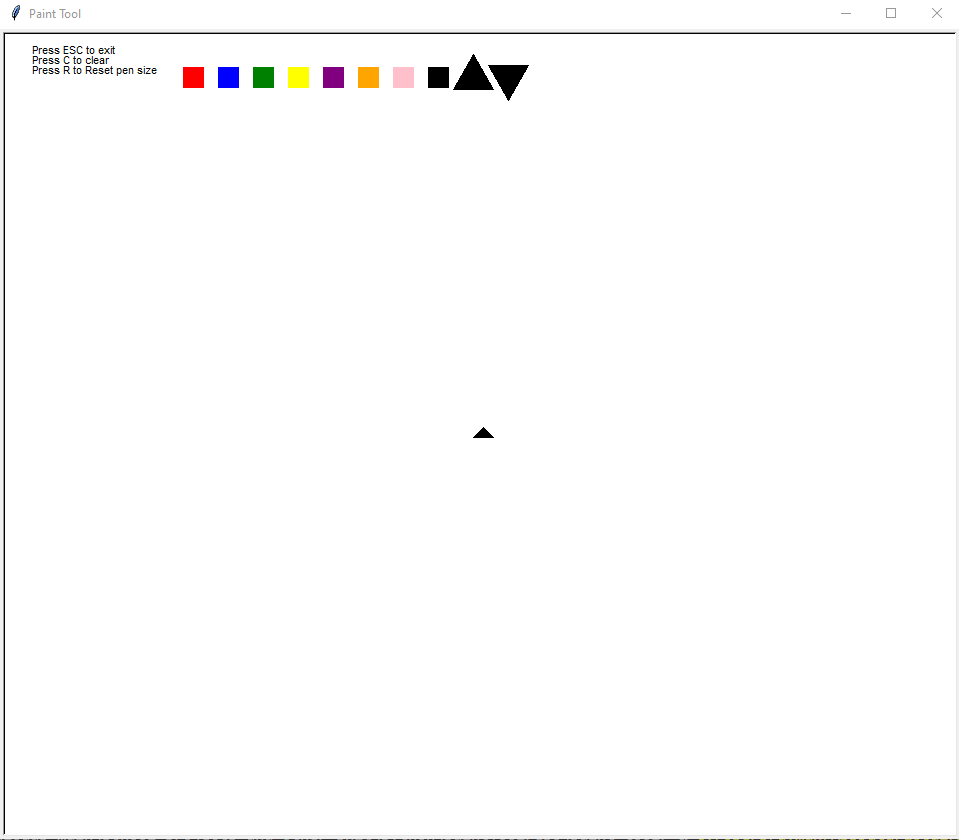

## Python Paint Tool Created by: Ayman Taleb 2018

This is a painting app like MS Paint made with turtles. I made it for my final in my first CS class. You can only draw one line. I plan on improving it.

Here is the main window:

The colors at the top are used to change the colors of the paint tool. The up and down arrows are used to resize the tool. 

## Installation

Just download the python file and run it through terminal or an IDE. Be sure to fullscreen the window.
